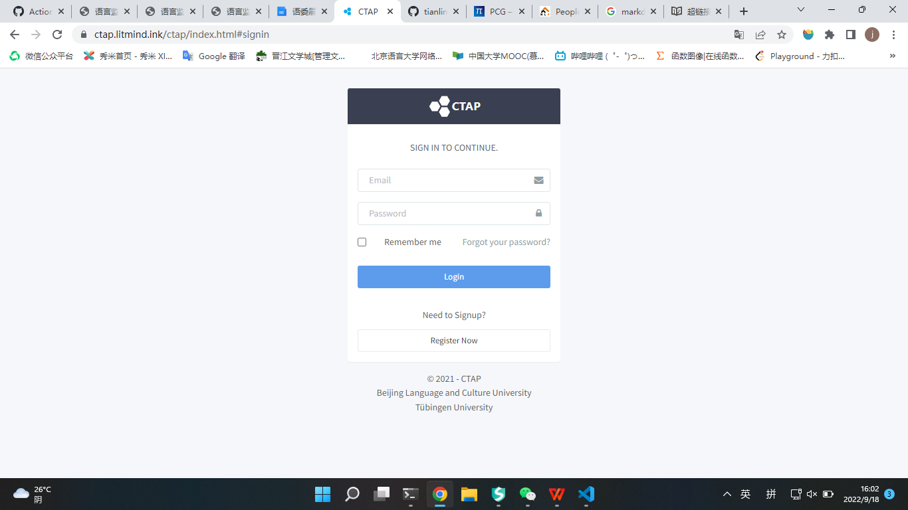

本中心与图宾根大学陈小彬教授团队合作推出了中文CTAP—汉语文本复杂度分析平台。中文 CTAP 实现了包含字、词、 句三个层面近百个复杂度特征。其中，字层面的特征主要包括字类数、字型数、字形例比及形例比的各种变体；词层面的特征主要包括词汇丰富度、词汇多样度、词性密度、词语复杂度四个维度；句层面的特征主要包括句子长度、句法成分数、句法复杂度三个维度。 

[CTAB](http://ctap.litmind.ink)

<!--  -->

 条件随机场模型示意图 

